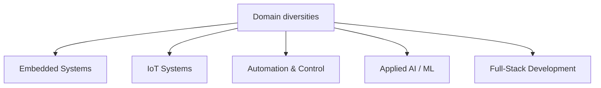

<!-- ================================================== -->
<!--            GITHUB PROFILE README (PRO)             -->
<!-- ================================================== -->

### 🎓 R&D | Automation | Control Systems | AI-Augmented Full-Stack Developer

 

---

## 👨🏻‍🎓 Professional Overview

I am an **Embedded Systems and IoT Engineer** working in the **Research & Development** domain, focused on building **new technologies, intelligent systems, and automation platforms**.

I am currently a **Project Intern & Researcher at IIT Kharagpur**, where my work centers on **automation and control-oriented research**, integrating **machine learning techniques with classical control systems (PID-based architectures)**.

In parallel, I work as an **AI-Augmented, Prompt-Driven Full-Stack Developer**, delivering **end-to-end, production-ready web applications**. My use of AI is **engineering-driven**, leveraging **precise prompts, architectural constraints, and system-level reasoning**.

> **Core Strength:** Designing systems at the **intersection of hardware, software, control theory, and AI**.

---

## 💻 Tech Stack

<!-- Row 1: Embedded Systems & EDA -->

  
  
  
  
  
  
<!-- Row 2: Machine-Learning and Automation -->
  
  
  
  
  
  
  
  
<!-- Row 3: Frontend Technologies -->
  
  
  
  
  
  
  
  
<!-- Row 4: Backend & APIs -->
  
  
  
  
  
  <!-- Row 5: Databases & Deployment -->
  
  
  
  
  
  
  <!-- Row 6: Programming Languages -->
  
  
  

  <strong>
    
    🧮 A structured, production-oriented technology stack spanning Embedded Systems with IoT, full-stack web engineering, Automation and deployment infrastructure.
  
  </strong>

---

## 👨🏻‍🔬 Research & Engineering Focus

<!-- ================================================== --> <!-- SYSTEMS ENGINEERING STACK --> <!-- ================================================== -->
🏗️ Systems Engineering Stack
Philosophy: Co-design of hardware, control, intelligence, and software — engineered as one system, not isolated parts.

<!-- ================= EMBEDDED SYSTEMS & IOT ENGINEERING ================= -->

## 👨🏻‍💻 Embedded Systems & IoT Engineering

> **Engineering scope:** Hardware-centric system design spanning sensing, computation, communication, and edge-to-cloud integration.

---

### 🔹 Core Embedded Domains

<table>
<tr>
<td width="33%" valign="top">

#### ⚙️ Embedded Compute

  

- **Platforms:** Arduino, ESP32, Raspberry Pi  
- OS-based firmware  
- GPIO, timers, interrupts  
- Peripheral-level programming  

</td>

<td width="33%" valign="top">

#### 🔬 Sensors & Instrumentation

  

- Analog & digital sensors  
- Industrial transmitters  
- Calibration & signal conditioning  
- Measurement accuracy validation  

</td>

<td width="33%" valign="top">

#### 📶 Communication Systems

  

- UART, I²C, SPI  
- RS-485, Modbus  
- Robust device communication  
- Fault-tolerant data exchange  

</td>
</tr>
</table>

---

### 🔹 System Realization & Integration

<table>
<tr>
<td width="50%" valign="top">

#### 🛠️ Hardware Design & Validation

- Schematic design & circuit analysis  
- Power & signal integrity  
- SPICE-based simulation  
- Prototyping & iteration  

</td>

<td width="50%" valign="top">

#### 💭 IoT System Integration

  

- **Pipeline:** Sensor → MCU → Edge → Cloud  
- Data acquisition pipelines  
- Edge orchestration & monitoring  
- Production-ready integration  

</td>
</tr>
</table>

---

  <strong>
    
      ⚒️ Hardware-first, reliability-driven embedded system engineering — designed for production environments, not demos.
    
  </strong>

<!-- ================= CONTROL SYSTEMS & AUTOMATION ENGINEERING ================= -->

## 🎛️ Control Systems & Automation Engineering

> **Engineering scope:** Design, analysis, and implementation of closed-loop control systems for real physical processes.

---

### 🔹 Core Control Engineering Domains

<table>
<tr>
<td width="33%" valign="top">

#### 🎚️ Classical Control

  

- PID design & tuning  
- Stability & transient analysis  
- Closed-loop performance metrics  
- Actuator interfacing  

</td>

<td width="33%" valign="top">

#### 📈 System Identification

- Experimental modeling  
- Parameter estimation  
- Data-driven plant models  
- Noise & uncertainty handling  

</td>

<td width="33%" valign="top">

#### ⏱️ Real-Time Control

- Real-time feedback loops  
- Sensor → controller → actuator  
- Embedded implementation  
- Deterministic execution  

</td>
</tr>
</table>

---

### 🔹 Automation & Intelligent Control

<table>
<tr>
<td width="33%" valign="top">

#### 🤖 ML-Assisted Control

- ML + PID hybrid strategies  
- Adaptive control logic  
- Online parameter adjustment  
- Performance optimization  

</td>

<td width="33%" valign="top">

#### 📊 Data-Driven Modeling

- Time-series analysis  
- Feature extraction  
- Model validation  
- Control-oriented datasets  

</td>

<td width="33%" valign="top">

#### 📟 Intelligent Automation

- Decision logic  
- Intelligent monitoring  
- Fault detection  
- Closed-loop automation  

</td>
</tr>
</table>

---

  <strong>
    
      🕹️ Control logic engineered for real physical systems — validated through experiments, not simulations alone.
    
  </strong>

</td> </tr> </table>
<!-- ================= AI-AUGMENTED FULL-STACK ENGINEERING ================= -->

## 📑 AI-Augmented Full-Stack Engineering

> **Engineering scope:** End-to-end software systems designed with architectural rigor, performance constraints, and AI-assisted development workflows.

---

### 🔹 Application Architecture Layers

<table>
<tr>
<td width="33%" valign="top">

#### 🪟 Frontend Systems (User Interfaces)

  
    

  

- React + TypeScript (.tsx) component-driven architecture  
- Vite-powered high-performance builds  
- Tailwind CSS + PostCSS utility-first styling  
- shadcn/ui–based design system & components  
- Context API for application-wide state  
- Industrial dashboards, gauges & trend analysis  
- Animated inputs, transitions & device modals  

</td>

<td width="33%" valign="top">

#### 🚪 Backend Systems (APIs & Logic)

  

  

- Node.js backend services (JavaScript)  
- Express.js modular REST API architecture  
- Stateless & versioned endpoints  
- Custom JWT & session-based authentication  
- Role-based admin, device & sensor access  
- Domain services (analytics, devices, sensors, readings)  
- Production validation, test & verification scripts  

</td>

<td width="33%" valign="top">

#### 🗂️ Data & Infrastructure (Persistence & Ops)

  

  
  

- PostgreSQL for production-grade workloads  
- SQLite for fallback / embedded-local storage  
- Structured data access via service layers  
- CI/CD pipelines driven by Git workflows  
- Frontend deployments on Vercel  
- Backend deployments on Render  
- Environment-based configs, rollback & reliability practices  

</td>
</tr>
</table>

  <strong>
    
    🧮 Layered application architecture engineered for real production systems — UI, APIs, data, and infrastructure designed together, not in isolation.
    
  </strong>

---

### 🔹 AI-Augmented Engineering Workflow

<table>
<tr>
<td width="100%" valign="top" >

#### 🎯 Guided Workflow

  

- **Prompt-Driven Development** → AI guided by explicit architectural constraints  
- **System-Level Reasoning** → Design decisions before implementation  
- **Human-in-the-Loop Validation** → Review, refactoring, optimization  
- **Production Discipline** → Maintainability, scalability, fault tolerance  

</td>
</tr>
</table>

---

  <strong>
    
    ⚡ Full-stack systems engineered with the same rigor as embedded hardware — not rapid prototypes.
  
  </strong>

## 📂 Representative Work
Embedded Automation Systems — Closed-loop control platforms

IoT Monitoring Systems — Edge-to-cloud pipelines

ML-Enhanced Control Research — Hybrid ML + PID

Production Web Applications — Secure & scalable

## 🤝 Collaboration & Opportunities
R&D-Focused Engineering Roles

Embedded & IoT Product Teams

Automation & Control Research

Deep-Tech & Applied AI Startups

  <strong>
    
    📬 Let’s build intelligent systems that tightly couple hardware, software, and intelligence.
  
  </strong>

## 🌐 Socials

  
  

     

